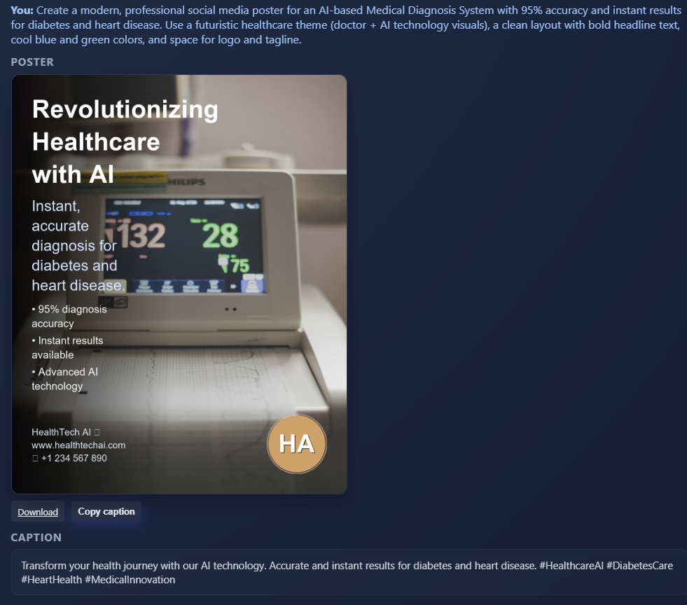
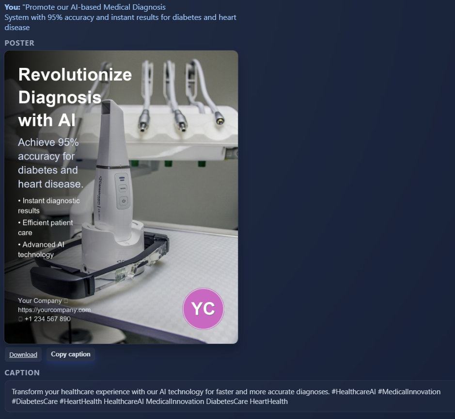
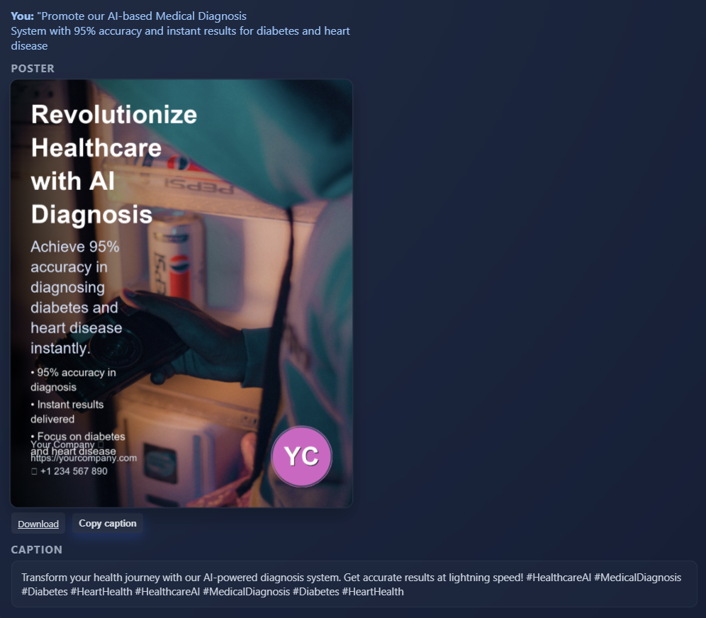

# **AI Poster Chat – AI-Based Medical Diagnosis Poster Generator**

An AI-powered web app that generates **professional social media posters** and **captions** to promote an **AI-Based Medical Diagnosis System**.  
Users can input a simple prompt, and the app creates **ready-to-post posters with branding, AI-generated captions, and download options**.

---

## **Features**
- **AI Text Analysis (NLP):**
  - Extracts keywords, tone, and sentiment from the prompt.
  - Highlights key metrics like *"95% accuracy"* on the poster.
  
- **AI Poster Generation:**
  - Uses **OpenAI DALL·E** to create medical-themed posters (e.g., doctors using AI, healthcare visuals).
  - Automatically applies **branding and company logo**.

- **Caption Generation:**
  - Auto-generates **social-media-ready captions** with hashtags like `#AIHealthcare` or `#FutureOfMedicine`.

- **Modern UI:**
  - Gradient background, rounded corners, and hover effects.
  - **Download Poster** & **Clear History** buttons for convenience.

- **Multiple Variations:**
  - Optionally generates multiple poster versions for each prompt.

---

## **Tech Stack**
- **Backend:** Flask (Python)
- **Frontend:** HTML5, CSS3, JavaScript (AJAX-based chat interface)
- **AI Model:** OpenAI (DALL·E for images, GPT for NLP/captions)
- **Storage:** In-memory history (can be extended to a DB)
- **Deployment:** Render or any WSGI-compatible service

---

## **Project Workflow**
1. **Input Prompt:**  
   Example –  
   `"Promote our AI-based Medical Diagnosis System with 95% accuracy and instant results for diabetes and heart disease."`
2. **Text Analysis:**  
   Extracts keywords: *AI-based Medical Diagnosis, 95% accuracy, diabetes, heart disease.*
3. **Image Generation:**  
   Generates a relevant image with **AI & medical themes**.
4. **Poster Design:**  
   Adds branding, colors, and font styles suited for healthcare.
5. **Caption Generation:**  
   Creates catchy social captions:  
   *"Introducing our AI-powered medical diagnosis system – providing 95% accurate results within minutes! #AIHealthcare #DiagnosisRevolution"*
6. **Output:**  
   Downloadable poster + caption ready for social media.

---

## **Installation**

### **1. Clone Repository**
```bash
git clone https://github.com/BharatDhande/Poster-Genarator.git
cd poster generator
```

### **2. Create Virtual Environment**
```bash
python -m venv venv
source venv/bin/activate   # For Linux/Mac
venv\Scripts\activate      # For Windows
```

### **3. Install Dependencies**
```bash
pip install -r requirements.txt
```

### **4. Setup Environment Variables**
Create a `.env` file:
```
OPENAI_API_KEY=your_openai_api_key
```

---

## **Run the App**
```bash
flask run
```
The app will be live at: `http://127.0.0.1:5000`

---

## **Deploy on Render**
1. Push your code to GitHub.
2. Create a new Render Web Service.
3. Add environment variable `OPENAI_API_KEY` in the dashboard.
4. Use this **Start Command**:
   ```bash
   gunicorn app:app
   ```

---

## **Requirements**
See `requirements.txt`:
```
Flask
gunicorn
openai==1.35.15
requests
python-dotenv
Pillow
```

---

## **Screenshots**





---

## 🎥 Project Demo
[▶ Watch the Demo Video](demo.mp4)


## **Future Enhancements**
- Save poster history in a database.
- Enable image editing (e.g., add custom text or logos).
- Integration with social media posting APIs.
